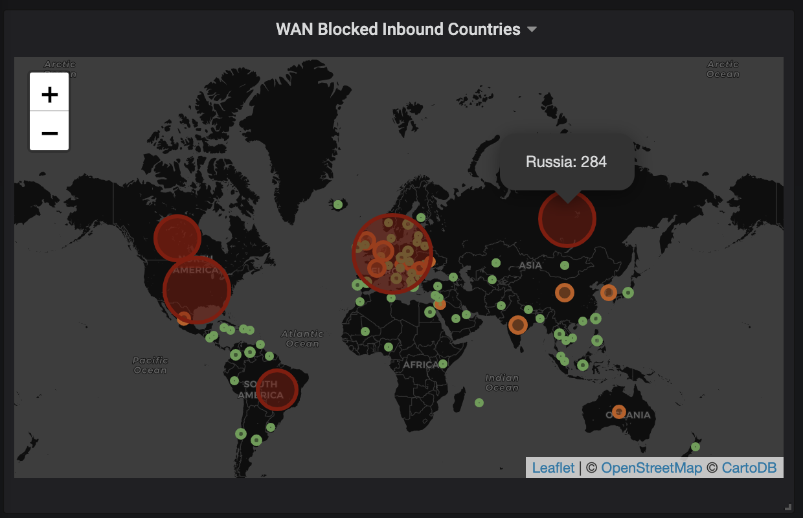

# pfSense Logstash


[](https://microbadger.com/images/threesquared/logstash-pfsense)

> Dockerfile to run a Logstash instance configured to relay pfSense firewall log entires into InfluxDB which can be visualised in Grafana



## Installation

This guide assumes you already have a working pfSense, InfluxDB and Grafana setup.

### pfSense

First you need to `Enable Remote Logging` in pfSense, this can be found in `Status/System Logs/Settings`. Then be sure to put the address to reach the Logstash docker container in `Remote log servers` and check `Firewall Events`.

### InfluxDB

You will also need to create a database called `firewall` in your InfluxDB (This can be configured in `pipeline/30-outputs`). You might also want to add a retention policy to automatically prune old data.

### Grafana

Finally connect up your InfluxDB instance as a source in Grafana and then you can create visualisations based on the data. The JSON for the example worldmap panel of inbound blocked WAN countries is included [here](./panel.json).

## Running

You can use the image in a compose file:

```yaml
version: '2'
services:
  server:
    image: threesquared/logstash-pfsense:latest
    ports:
      - "5140:5140"
      - "5140:5140/udp"
```

Or just as a run command:

```bash
$ docker run -d --name logstash \
             -p 5140:5140/udp -p 5140:5140 \
             threesquared/logstash-pfsense
```

## Building

```bash
$ docker build -t threesquared/logstash-pfsense .
```
